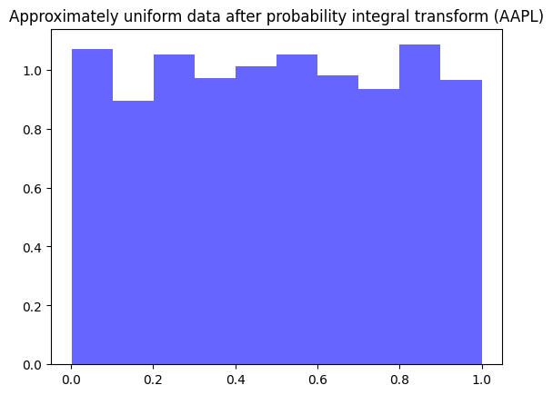
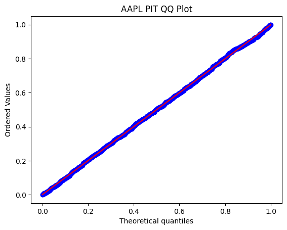
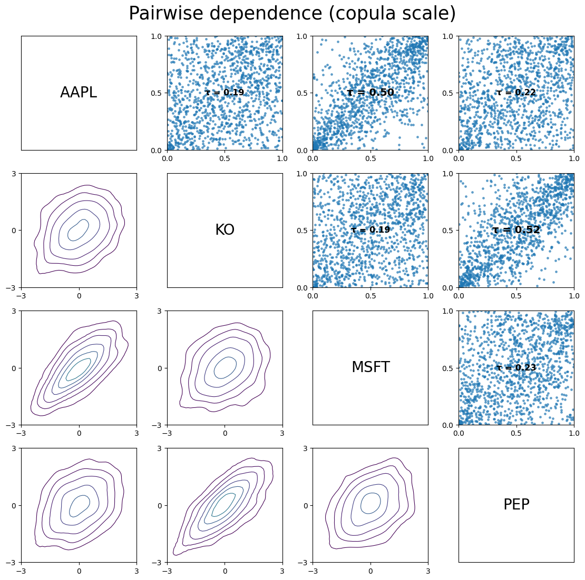
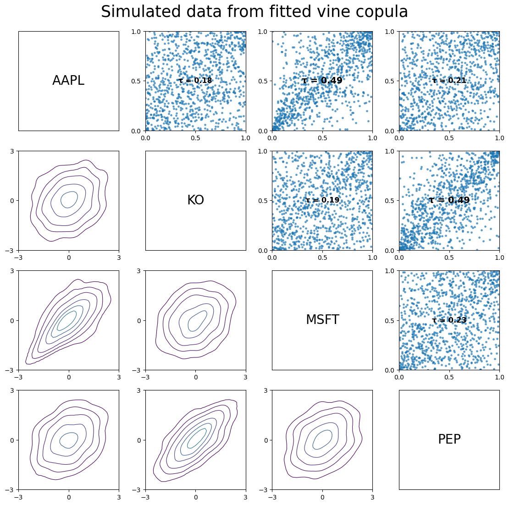
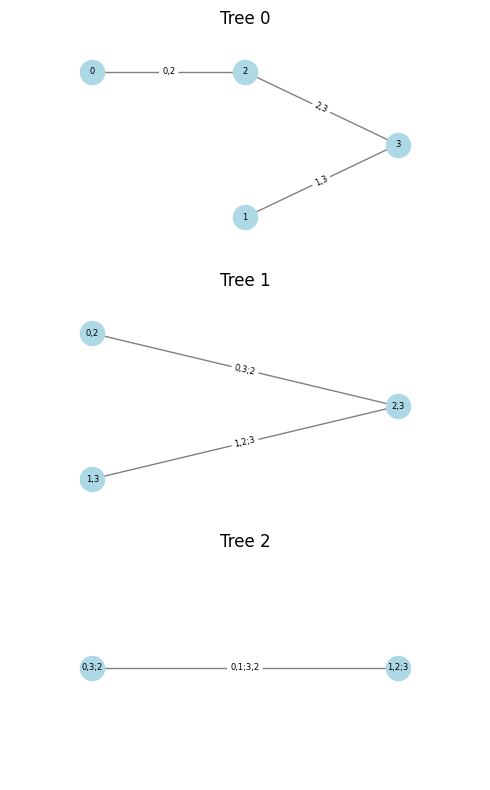

# Vine Copula Scenario Generation

A Python project for **multivariate financial return modeling and simulation**.

This script combines **univariate GJR-GARCH marginal models** with a **vine copula dependence structure** to generate **one-step-ahead joint return scenarios** for multiple assets. Standardized residuals are transformed to the copula scale using the **probability integral transform (PIT)**, a vine copula is fitted to the transformed data, and simulations are mapped back into return space using the fitted marginal models. This was motivated through the Master's Thesis in finance I am currently working on, using similar methods.

## Overview

The aim of this project is to model cross-asset dependence beyond linear correlation by separating the problem into:

1. **Marginal dynamics**  
   Each asset return series is modeled individually using a GJR-GARCH specification with Student-t innovations.

2. **Dependence modeling**  
   Standardized residuals are transformed to approximately uniform variables via PIT and used to fit a vine copula.

3. **Scenario generation**  
   Samples are simulated from the fitted copula and transformed back into one-step-ahead return scenarios using the GARCH forecasts.

## Methodology

The script follows these steps:

1. Download daily asset price data from Yahoo Finance.
2. Compute log returns.
3. Fit a GJR-GARCH(1,1)-type model with t-distributed errors to each return series.
4. Extract standardized residuals from the fitted marginal models.
5. Apply the probability integral transform to obtain approximately uniform data.
6. Fit a vine copula to the transformed multivariate data.
7. Simulate new observations from the fitted vine copula.
8. Apply the inverse PIT to recover standardized residual scenarios.
9. Convert simulated residuals into one-step-ahead return scenarios using the GARCH forecasts.

## Current Features

- Multi-asset price download via Yahoo Finance
- Log return calculation
- Univariate GJR-GARCH marginal modeling
- Student-t probability integral transform (can be changed between Gaussian, t, and skewed t distributions)
- Uniform-scale diagnostic plots
- Vine copula fitting with automatic family selection
- Simulation from the fitted vine copula
- Inverse PIT transformation
- One-step-ahead joint return scenario generation

## Example Output

The script currently produces:

- fitted GARCH model summaries for each asset
- histograms and QQ-plots of PIT-transformed residuals
- pairwise dependence plots on the copula scale
- simulated copula-scale data from the fitted vine model
- a table of simulated one-step-ahead return scenarios

Below is a histogram of the probability integral transformed standardised residuals for Apple stock, and a QQ-plot compared to a U~(0,1) distribution.

This picture shows pairwise plots of the uniform data for four different stocks (AAPL, KO, MSFT, PEP), with contour plots and Kendall's Tau values for each pair.

This next picture shows the same, however for Monte Carlo simulated uniform data from the fitted vine copula. 

This final graph is a simple illustration of the vine structure for the four stocks.

## Motivation

This repository was built as a compact quantitative finance project to demonstrate:

- volatility modeling
- copula-based dependence modeling
- Monte Carlo simulation
- multivariate scenario generation for financial returns

## Limitations

This is a research / portfolio project rather than a production-ready risk engine. In particular:

- data is sourced from Yahoo Finance
- the implementation focuses on one-step-ahead scenarios
- model validation is limited
- transaction costs, portfolio construction, and downstream risk metrics are not yet included
- some visualization features may require a local Graphviz installation (e.g. plotting of the vine tree structure)

## Possible Extensions

Natural next steps include:

- testing alternative marginal distributions
- comparing Gaussian and vine copula dependence models
- adding out-of-sample validation
- generating multi-step scenario paths
- applying the scenarios to portfolio VaR / expected shortfall estimation
- comparing simulated and historical dependence measures

## Python Libraries Used

- Python
- NumPy
- pandas
- matplotlib
- scipy
- arch
- yfinance
- pyvinecopulib
- graphviz
